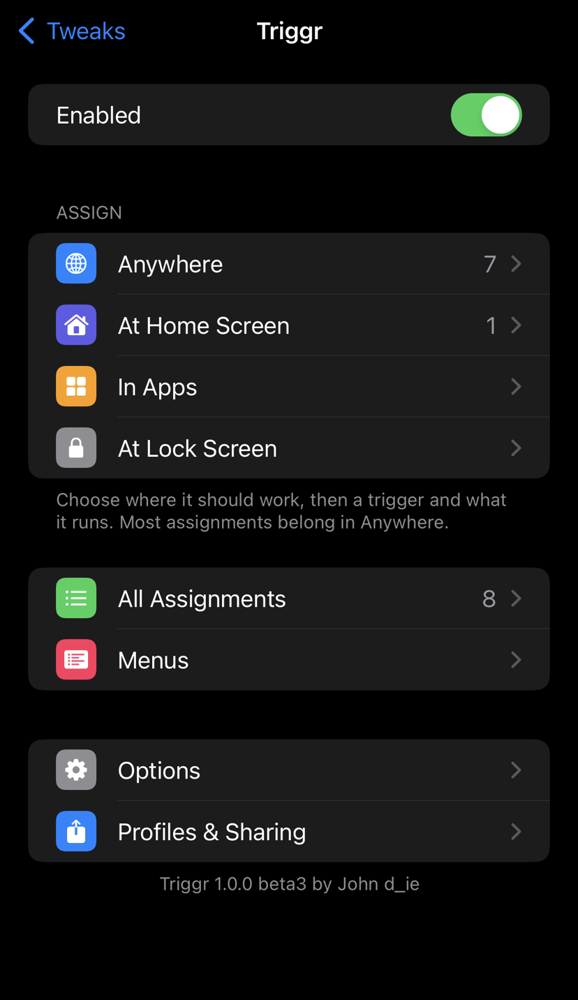
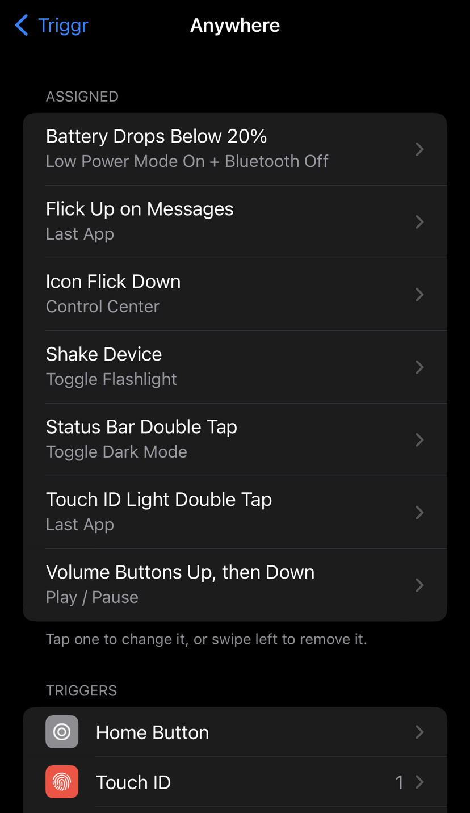
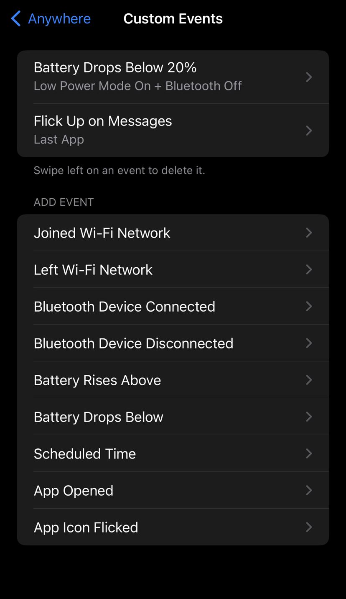
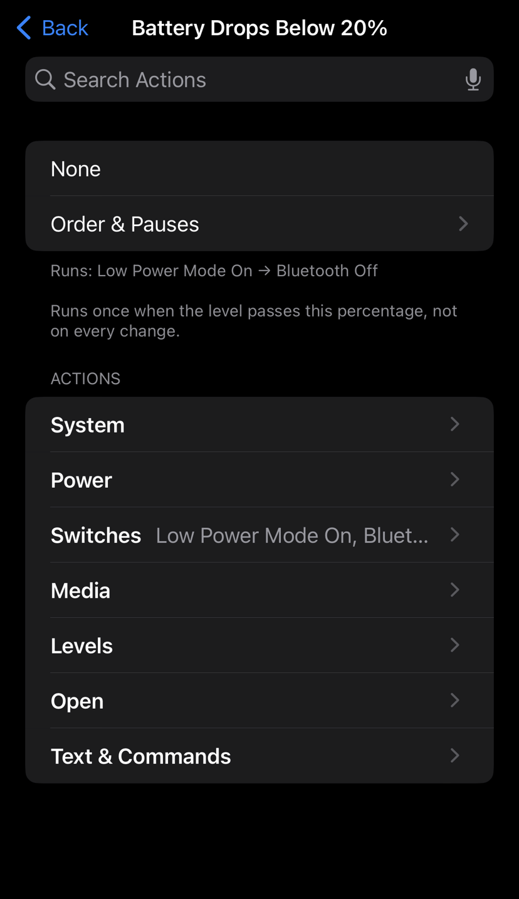
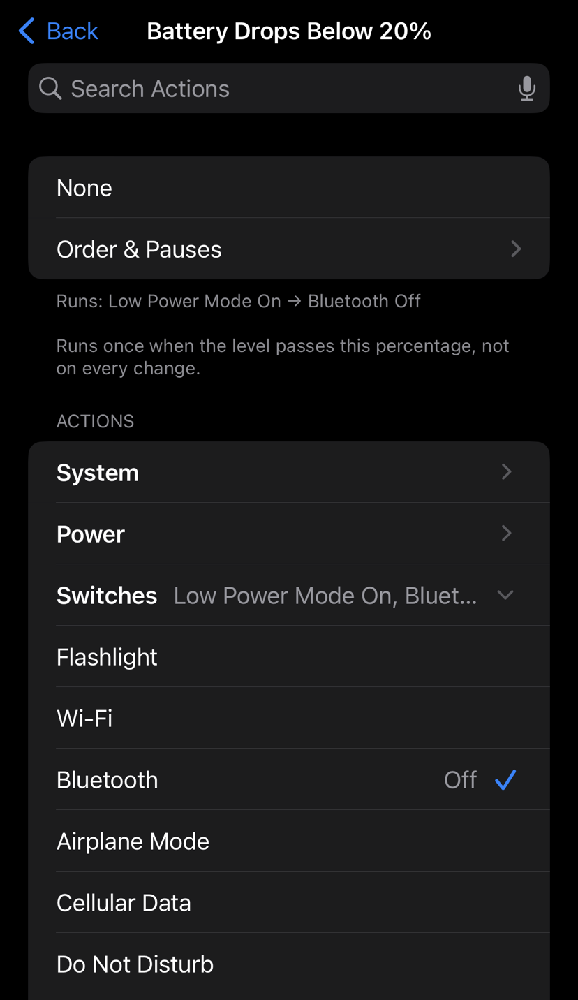
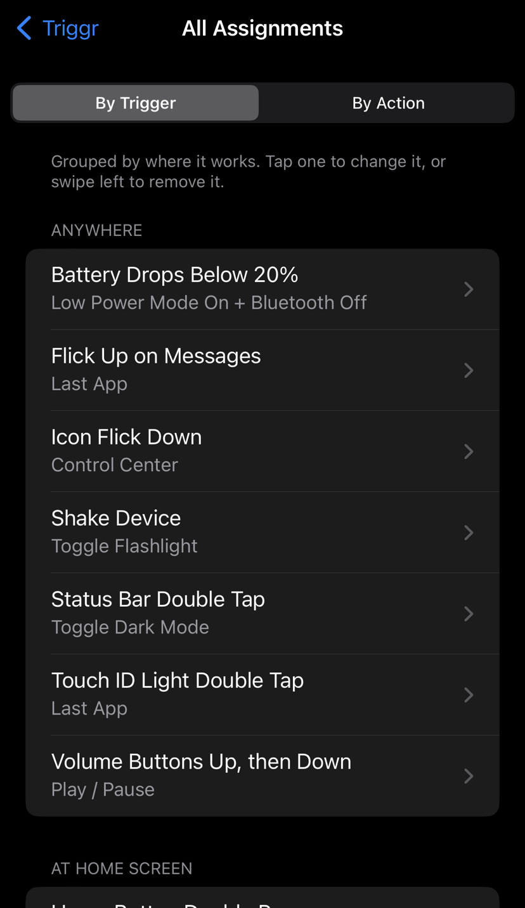
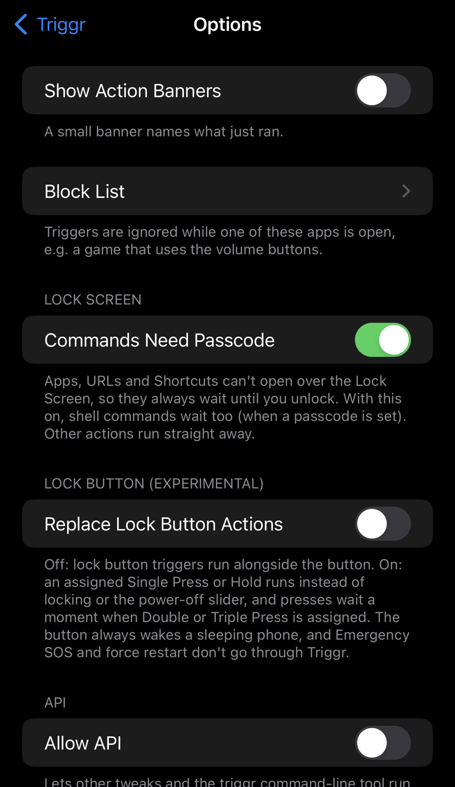

# Triggr: public beta

**Triggr** is an Activator-lite for **rootless Dopamine on iOS 15–16**. It lets you
assign actions to buttons, gestures and events, laid out like Activator.

> **Triggr is in public beta on [John's Repo](https://jond-ie.github.io/repo/).**
> This page is for feedback: bugs, crashes and requests go in
> [**Issues**](../../issues/new/choose). The source code isn't public.

## Screenshots

  
  
  
  
  
  
  

## Install

1. In **Sileo** (or Zebra): Sources → **+** → add `https://jond-ie.github.io/repo/`
   (or open [jond-ie.github.io/repo](https://jond-ie.github.io/repo/) on your device and tap **Add to Sileo**).
2. Install **Triggr**. Sileo installs **AltList** (BigBoss) and **PreferenceLoader**
   with it; if it can't find AltList, add BigBoss first.
3. Respring, then set it up in **Settings → Triggr**.

To remove it, uninstall **Triggr** in your package manager. The `.deb` files under
[Releases](../../releases) are older beta builds; use the repo for the current one.

## Supported devices

| Device | Status |
|---|---|
| **A11 and older (arm64) with Touch ID**, iOS 15–16 | Tested on iPhone 8 Plus, iOS 16.7 |
| **A12 and newer** (iPhone XS / XR and later, all Face ID devices) | **Not supported yet (arm64e).** Triggr is built for arm64 only for now and refuses to install on A12+, so it can't put these devices into safe mode. An early beta2 file did (a wrong arm64e build); if you installed that one on an A12+ device, uninstall it (safe mode still lets you open Sileo). |

By default Triggr never delays or blocks the lock/side button. An optional,
experimental setting (**Options → Replace Lock Button Actions**) lets an assigned
press or hold run instead of locking, like Activator; it leaves the presses that
Emergency SOS counts to iOS. If you rely on SOS, check it still starts after
turning that setting on.

## What it does

- **Triggers:**
  - Home button (single, double, triple, short and long hold).
  - Touch ID light double tap (replaces Reachability).
  - Lock/side button single, double, triple and hold.
  - Volume buttons (press, hold, up then down, down then up, both buttons).
  - Mute switch.
  - Status bar taps.
  - Home Screen icon flicks (up, down, left, right), for any icon or one app's icon.
  - Shaking the phone.
  - Charger and headphones.
  - Wi-Fi, Bluetooth, Low Power, lock and screen on/off state changes.
  - Custom events: a specific Wi-Fi network or Bluetooth device, battery %, an app
    opening, a scheduled time.
- **Actions:**
  - System actions: home, app switcher, last app, quit app, Control Center,
    Notification Center, Spotlight, Reachability, Siri, screenshot, vibrate.
  - Power actions: lock, respring, power-off slider, Safe Mode, restart, power off.
  - Toggle / on / off switches: flashlight, Wi-Fi, Bluetooth, Airplane Mode,
    cellular data, Do Not Disturb, Low Power Mode, rotation lock, mute, Dark Mode,
    Night Shift, Auto-Brightness, Keep Screen Awake, Location Services.
  - Media controls.
  - Brightness and volume levels.
  - Messages and spoken text.
  - Settings pages.
  - Apps, URLs, Shortcuts and shell commands.
  - Menus.
- **Several actions per trigger,** with pauses and reordering.
- **Light on the system:** the main library loads into SpringBoard only; apps get a
  tiny relay for status bar taps and shakes, and nothing runs for a trigger that
  isn't assigned.
- **Settings that fit on one screen:** triggers grouped by button, actions folded
  into categories with search, swipe left to remove things.
- **Modes:** Anywhere, Home Screen, In App, Lock Screen.
- **Lock Screen safety:** apps, URLs and shell commands wait for you to unlock.
- **Extras:**
  - Block List.
  - Action banners.
  - Profiles.
  - Export and import of setups.
  - Reset to defaults.
  - An opt-in API and a `triggr` command-line tool.

## Known limits

- Menus don't open while the device is locked.
- Scheduled events are skipped if iOS runs them more than 5 minutes late (e.g.
  while the phone sleeps).
- Not tested yet:
  - Volume up then down / down then up with the real buttons (checked through code).
  - Restart and Power Off.
  - Finger Rest / Match.
  - Status bar taps on the Lock Screen.
  - Wired headphones.
  - Devices without a passcode.

## Feedback

Please use [**Issues**](../../issues/new/choose):

- **Crash report:** Triggr or SpringBoard crashed, or you hit safe mode.
- **Bug report:** something doesn't work as expected.
- **Feature request:** ideas, or something from Activator you miss.

Always include your **device model, iOS version, jailbreak and Triggr version**.

### Getting a crash log

1. Open **Settings → Privacy & Security → Analytics & Improvements → Analytics Data**.
2. Find the entry from the time of the crash. Look for **SpringBoard**,
   **Preferences** or **Triggr** in the name.
3. Tap it, then share or copy the text into your crash report.

**Check before posting:** crash logs and exported setups can include personal
details. Examples are app names, Wi-Fi network or Bluetooth device names used in
your events, and shell commands. Remove anything you don't want public.

## Credits

Triggr is by **John d_ie**, inspired by Activator (Ryan Petrich). It was developed
with AI assistance (Claude Code) and tested on-device.
